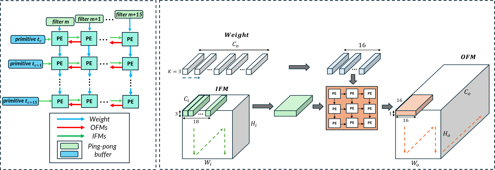

# FPGA-based CNN Accelerator
Author:  **Nguyen Van Luu** - nluu1784@gmail.com
**Nguyen Thi Thuy Linh** - thuylinh041203@gmail.com

**Do Viet Dung** - Dung.DV224340@sis.hust.edu.vn

  
  Name of Institute: **School of Electrical and Electronic Engineering (SEEE)-HUST**    

  Language: **Verilog, Python**

  Framework: **Pytorch**
  
  Tools: **Cadence Xcelium, Vivado**

  ## *<span style="font-size: 24px;">Status:</span>*  
Data generation script, detailed architecture and pipeline strategy will be soon updated


# Introduction 
* Systolic arrays are widely used in deep neural network accelerators due to their regular dataflow and high parallelism. A 16×16 systolic array architecture is presented to accelerate CNN workloads. Modern CNNs introduce multi-scale feature maps and varying layer dimensions, which can lead to resource underutilization due to bubble cycles.
* Input feature maps (IFMs) are streamed across the array, while weights are loaded in a structured manner. Partial sums are accumulated within each processing element (PE) until final output feature maps (OFMs) are generated and stored. Both IFMs and weights use 16-bit precision, and OFMs are also quantized to 16 bits.
* An AXI interface is integrated to enable communication with off-chip memory, supporting a 128-bit data width and burst lengths of up to 256 beats.
* An efficient dataflow mapping strategy and a multi-stage pipeline are applied to hide off-chip memory latency and improve throughput. IFMs of size Cin×18×18 are first loaded into on-chip cache and then fed into a double-buffer structure. Weights are loaded sequentially; for example, 64 input channels require four loading iterations with 16 filters each time.
* The architecture supports convolution and max-pooling operations, flexible kernel sizes, and various IFM shapes. Currently, stride = 1 and padding = 1 are supported, with future extensions planned.


# ARCHITECTURE OF SYSTEM
* Overall, the architecture includes IFM/OFM caches for data preloading, IFM/weight ping-pong buffers located near the systolic array, as well as activation function and max-pooling blocks.

# Systolic array and data tiling strategy
* The figure above shows the PE connections and the input feature map tiling strategy. Each IFM tile has a size of C_in × 18 × 18, while each filter contains all kernel weights and is loaded into a buffer.
* For example, with a kernel size of 3, padding of 1, and 3 input channels, each tile produces output feature maps of size 3 × 16 × 16. After max-pooling, the output size becomes 3 × 8 × 8.



# Simulation
* To perform simulation, we prepare a file named wgt.txt that contains all weights of the CONV1 layer in YOLOv3-tiny.
* The input feature maps are generated using Python. Both datasets are calculated using a reference model implemented in the PyTorch framework. The script for this process is not included here.
* We also convert both datasets into binary format for simulation. The output feature maps (OFMs) after the max-pooling operation in CONV1 are generated by the RTL design. These results are then compared with the golden data produced by the reference model. 
* First, unzip the parameter file located in ./data/wgt.zip:
```sh
cd ./data
unzip wgt.zip
```
* We highly recommend to use Cadence tool for running simulation, if you use other tool, you should edit file makefile in folder ./run to math with your tool.
```sh
Edit this line if you don't use Xcelium of Cadence:
all:
    xrun -access +rwc -sv -linedebug \
             -input "run.tcl" \
                   -f listfile.f
```
```sh
cd ./run
make all
```
* Please be patient, as the simulation may take a considerable amount of time (approximately 10 to 15 minutes). During the simulation, the OFM results will be printed to the console as shown below:
```sh
OFM: 0000000000000000000000000000000000000000000000000000000000000000
OFM: 0000000000000000000000000000000012ca12d712e6131e134012e012d2128e
OFM: 0000000000000000000000000000000006390639063606330615061305f505cb
OFM: 00000000000000000000000000000000047c0472047c046b047c048204710475
OFM: 0000000000000000000000000000000047ee481f47d2482247f8477246eb462c
OFM: 0000000000000000000000000000000000000000000000000000000000000000
OFM: 0000000000000000000000000000000000000000000000000000000000000000
OFM: 0000000000000000000000000000000000000000000000000000000000000000
OFM: 0000000000000000000000000000000000000000007300310079005c00460000
OFM: 00000000000000000000000000000000049104f005440519053a050205503ddb
OFM: 0000000000000000000000000000000000350056008b000c0000000000000000
OFM: 00000000000000000000000000000000010e008c012500af005100ce003b0000
OFM: 0000000000000000000000000000000000000000000000000000000000000000
OFM: 000000000000000000000000000000000076001e000000000000009e00bf0000
OFM: 000000000000000000000000000000003d8f3db63d7f3dca3dab3d3e3caf3c18
OFM: 0000000000000000000000000000000000000000000000000000000000000000
OFM: 0000000000000000000000000000000000000000000000000000000000000000
OFM: 0000000000000000000000000000000012fc12ea12e9131512d2130d12de12e4
```
* After the simulation is completed, the golden output is loaded and compared with the RTL results. If all values match, the simulation will display the following result: 
```sh
██████╗  █████╗ ███████╗███████╗    ████████╗███████╗███████╗████████╗                                                                               
██╔══██╗██╔══██╗██╔════╝██╔════╝    ╚══██╔══╝██╔════╝██╔════╝╚══██╔══╝                                                                               
██████╔╝███████║███████╗███████╗       ██║   █████╗  ███████    ██║
██║     ██║  ██║╚════██║╚════██║       ██║   ██║          ██║   ██║  
██║     ██║  ██║███████║███████║       ██║   ███████╗███████╗   ██║                                          
╚═╝     ╚═╝  ╚═╝╚══════╝╚══════╝       ╚═╝   ╚══════╝╚══════╝   ╚═╝
```


# Block design on Vivado


# Layout of chip on ZCU104


