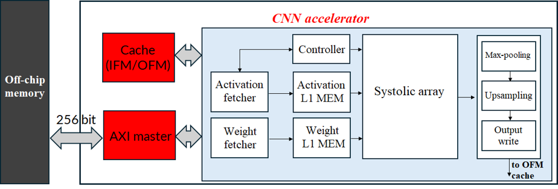
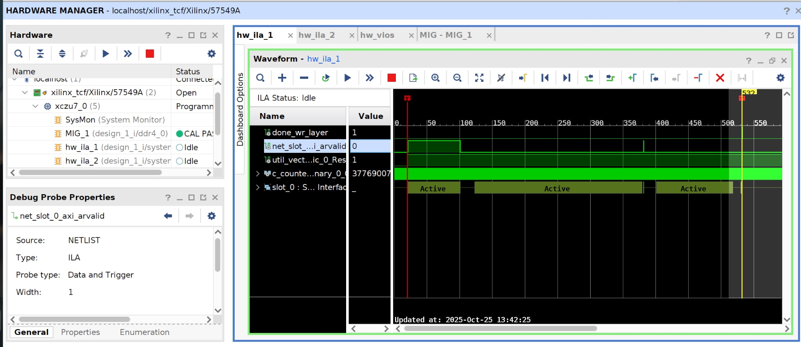

# Yolo_v3_Tiny_AXI
Author:  **Nguyen Van Luu** - nluu1784@gmail.com
**Nguyen Thi Thuy Linh** - linh041203@gmail.com
  
  Name of Institute: **School of Electrical and Electronic Engineering (SEEE)-HUST**    

  Language: **Verilog, Python**

  Framework: **Keras, Pytorch**
  
  Tools: **Cadence Xcelium, Vivado**
# Introduction 
* A systolic array is widely adopted in many deep
neural network accelerators due to their structured dataflow and
high parallelism. However, object detection models such as You
Only Look Once (YOLO) introduce multi-scale feature maps and
varying layer dimensions, which often lead to resource under
utilization due to unnecessary bubble cycles. Firstly, this work
proposes an enhanced systolic array architecture that integrates
an effective dataflow mapping strategy with a multi-pipeline
computing scheme to improve throughput. Secondly, a dynamic
data reuse strategy based on the amount of data processed
by each layer is introduced to reduce off-chip memory traffic.
Experiments on YOLOv3-tiny show that the proposed design
achieves an inference speed of 15.88 FPS and a throughput of
88.82 GOPS at a clock frequency of 230 MHz.
# ARCHITECTURE OF SYSTEM


# Simulation
* To perform simulation, we prepare a file named wgt.txt that contains all weights of the CONV1 layer in YOLOv3-tiny.
* The input feature maps are generated using Python. Both datasets are calculated using a reference model implemented in the PyTorch framework. The script for this process is not included here.
* We also convert both datasets into binary format for simulation. The output feature maps (OFMs) after the max-pooling operation in CONV1 are generated by the RTL design. These results are then compared with the golden data produced by the reference model. 
* First, unzip the parameter file located in ./data/wgt.zip:
```sh
cd ./data
unzip wgt.zip
```
* We highly recommend to use Cadence tool for running simulation, if you use other tool, you should edit file makefile in folder ./run to math with your tool.
```sh
Edit this line if you don't use Xcelium of Cadence:
all:
    xrun -access +rwc -sv -linedebug \
             -input "run.tcl" \
                   -f listfile.f
```
```sh
cd ./run
make all
```
* Please be patient, as the simulation may take a considerable amount of time (approximately 10 to 15 minutes). During the simulation, the OFM results will be printed to the console as shown below:
```sh
OFM: 0000000000000000000000000000000000000000000000000000000000000000
OFM: 0000000000000000000000000000000012ca12d712e6131e134012e012d2128e
OFM: 0000000000000000000000000000000006390639063606330615061305f505cb
OFM: 00000000000000000000000000000000047c0472047c046b047c048204710475
OFM: 0000000000000000000000000000000047ee481f47d2482247f8477246eb462c
OFM: 0000000000000000000000000000000000000000000000000000000000000000
OFM: 0000000000000000000000000000000000000000000000000000000000000000
OFM: 0000000000000000000000000000000000000000000000000000000000000000
OFM: 0000000000000000000000000000000000000000007300310079005c00460000
OFM: 00000000000000000000000000000000049104f005440519053a050205503ddb
OFM: 0000000000000000000000000000000000350056008b000c0000000000000000
OFM: 00000000000000000000000000000000010e008c012500af005100ce003b0000
OFM: 0000000000000000000000000000000000000000000000000000000000000000
OFM: 000000000000000000000000000000000076001e000000000000009e00bf0000
OFM: 000000000000000000000000000000003d8f3db63d7f3dca3dab3d3e3caf3c18
OFM: 0000000000000000000000000000000000000000000000000000000000000000
OFM: 0000000000000000000000000000000000000000000000000000000000000000
OFM: 0000000000000000000000000000000012fc12ea12e9131512d2130d12de12e4
```
* After the simulation is completed, the golden output is loaded and compared with the RTL results. If all values match, the simulation will display the following result: 
```sh
██████╗  █████╗ ███████╗███████╗    ████████╗███████╗███████╗████████╗                                                                               
██╔══██╗██╔══██╗██╔════╝██╔════╝    ╚══██╔══╝██╔════╝██╔════╝╚══██╔══╝                                                                               
██████╔╝███████║███████╗███████╗       ██║   █████╗  ███████    ██║
██║     ██║  ██║╚════██║╚════██║       ██║   ██║          ██║   ██║  
██║     ██║  ██║███████║███████║       ██║   ███████╗███████╗   ██║                                          
╚═╝     ╚═╝  ╚═╝╚══════╝╚══════╝       ╚═╝   ╚══════╝╚══════╝   ╚═╝
```


# Block design on Vivado


# Layout of chip on ZCU104

# Performance & Power consumption and hardware ultilization


